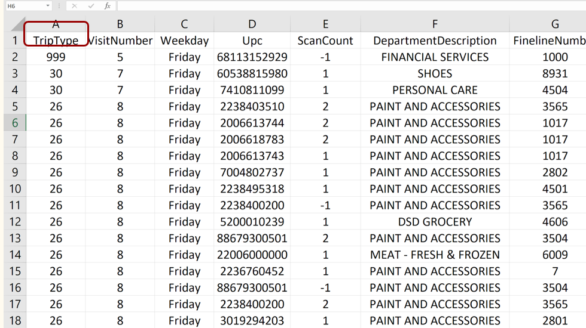
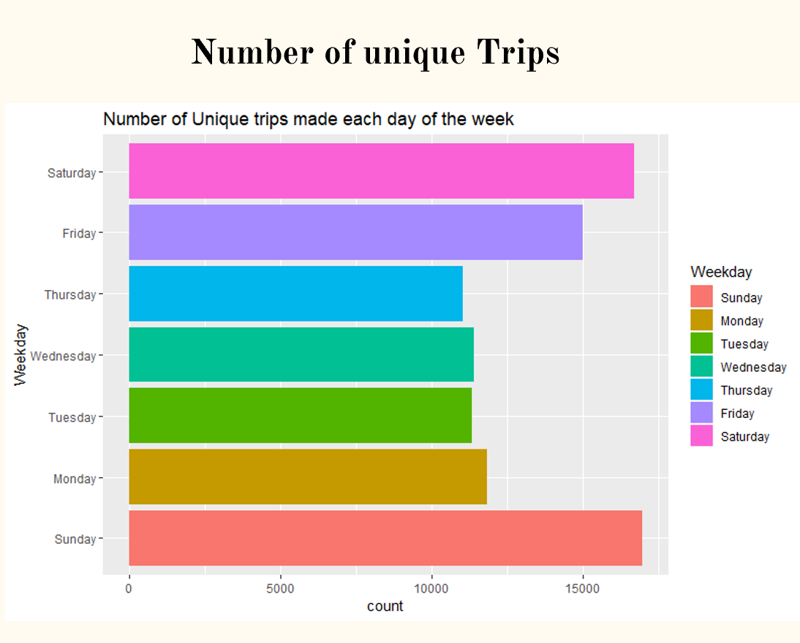
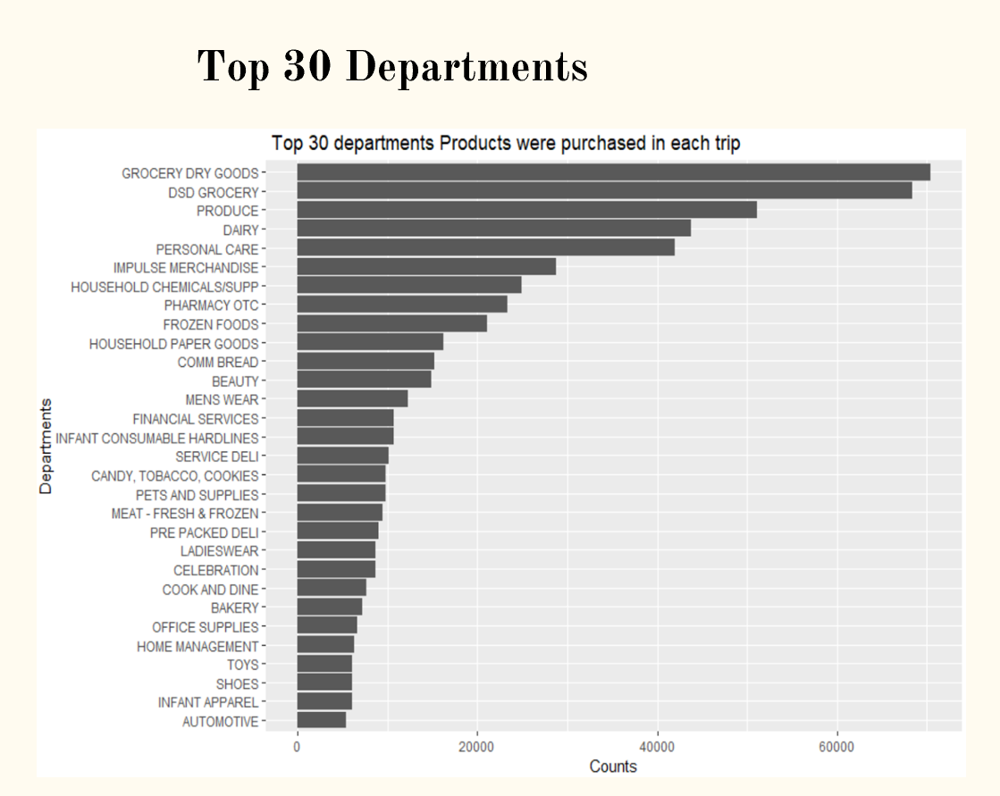
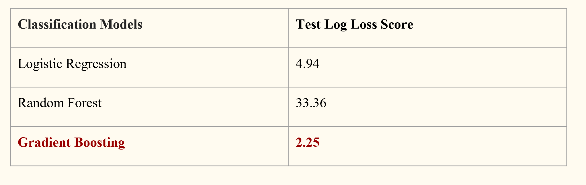

# Walmart-Trip-type-Prediction
This project is built as a part of end project for " Applied Statistics and Visualization for Analytics." course at GMU. The project utilized the data present in kaggle project (https://www.kaggle.com/c/walmart-recruiting-trip-type-classification).  

The objective of this project is to be able to classify customer trips at walmart using only a transactional dataset of the items they've purchased.  

### Data
The data was obtained from kaggle website and consists of various columns such as:  

Visualizations:

### Modelling
Used different classification model to predict trip type at Walmart using customer data. Models such as Random Forest and Gradient Boosting are applied. The code is completely written in R.

### Evaluations/Results:
Submissions are evaluated using the multi-class logarithmic loss.

